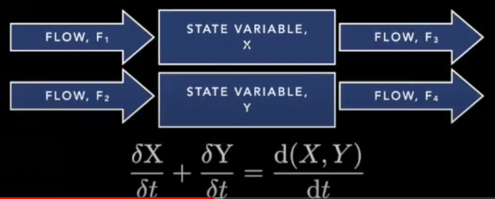
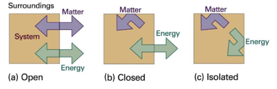
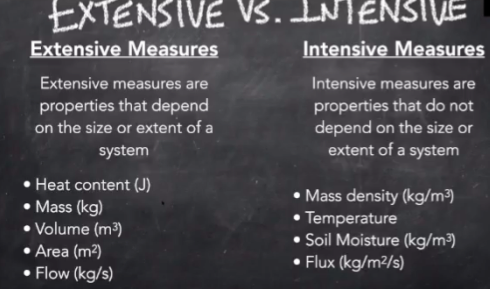
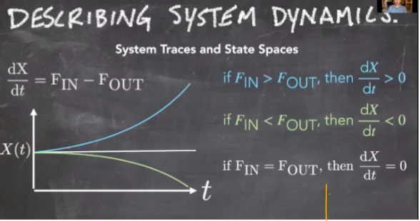
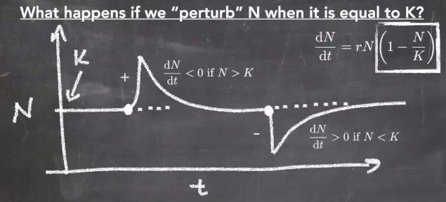

# Earth Systems Science {#principles}

## Overview

*Earth System Science* is the science that studies the whole planet as a system of innumerable interacting parts, and focuses on the changes within and among those parts.

It utilizes a **systems approach**, or **systems science**, which studies interacting and dynamic sets of subsystems. Systems thinking helps us understand large and complicated problems that might be difficult to grasp (i.e. global weather patterns) by breaking it down into smaller systems easier to grasp (i.e. air movement patterns).

Earth system science seeks an understanding of how all of Earth’s sub-systems coexist and affect each other under changing conditions. It was facilitated by the advent of **remote sensing** technologies and **GIS**, that allowed us to make continuous observations of Earth at a grand scale.

## Systems

A **system** is any portion of the universe that can be isolated from the rest of the universe for the purpose of observing and measuring changes. They represent coupled components that change over time. For example, a bike is a system that is made up of components like wheels, gears, and chains. When you couple the components with each other, the bike works.

The components (think wheels, gears, chains) are also known as **reservoirs, state variables**, or **stocks**.
The couplings (what links them together) are also known as **flows** or **links**. 

## System Representations {#state}

Systems are composed of **state variables**.

The **system state** is the value of the state variables in a system at a single point in time.

### Box Models

A **box model** is a simple graphical representation of a system that commonly depicts the storage and movement of materials and energy across interacting systems. They can be used to show essential quantitative features of a system such as the process and rate by which matter/energy enters and leaves, the process and rate by which matter/energy moves internally within various parts of the system, and the amount of matter/energy at a given time and its distribution across the parts of the system.
 
A box model often depicts the flow, or movement, of matter/energy from one system to another. A quantitative box model would likely depict the flux, which is the actual amount and rate of matter/energy being transferred.
 
The boxes of a box model represent **reservoirs**, which indicate a place where matter/energy are stored for a period of time within the system.
 
**Steady state** is when the flux of matter/energy into a reservoir matches the flux out of that reservoir.
 
A **sink** is when the flux of something into a reservoir is greater than the flux of that thing out of the reservoir.
 
A **source** is when the flux out of the reservoir is greater than the flux into it.
 
**Residence time** is the average amount of time some substance spends in a particular reservoir.

### Mathematical Models

System dynamics is the change in the system over time.

Mathematically speaking, change = Δ, the system = X, and time = t. Therefore…

ΔX/Δt (the derivative) is just the change in the system over the change in time.

ΔX/Δt (system dynamics) are determined by the flows.

Flows can be written as Flow~in~ + Flow~out~

Flow ins are usually positive, flow outs are negative.

Therefore, ΔX/Δt = Flow~in~ + Flow~out~

The partial derivative, (δ) is used to describe one portion of the system, such as the change in state variable x or state variable y. The partial changes add up to a whole change.

Changes can be

* **discrete** (Δ): happens at a specific point in time (MESM students incoming and outgoing happens at discrete time points)
* **continuous** (d): changes are ongoing (people entering and leaving a zoom call happens continuously). Continuous changes are usually demonstrated by a rate.

In ESS, we are almost always dealing with continuous variables, because things are always changing. 

## Types of Systems {#systemtype}

**Systems** are defined by their **boundaries**. We want to consider whether **energy** or **mass** can cross that boundary.

An **open system** allows flow of energy and mass.

A **closed system** allows flow of energy but not mass

An **isolated system** does not permit a flow of mass nor energy across its boundaries.

The Earth System itself is a (mostly) closed system, allowing energy in the form of solar radiation in, but no mass (apart from meteorites and traces of hydrogen atoms). The implications of this are significant because the amount of matter in a closed system is fixed and finite, and when changes are made in one part of a closed system, the results eventually affect the other parts of the system.

## Flows vs Fluxes

**Flow** - a quantity over time

**Flux** - a quantity over time per unit of area

## Extensive vs Intensive Variables {#variabletype}

**Extensive Measures** – properties that depend on the size or extent of a system.  If you have a larger system it will inherently have larger properties that make up that system.

**Intensive Measures** – properties that do not depend on the size or extent of a system.  This is a much more value measurement for comparing and understanding systems).

While it may not be immediately obvious, intensive variables tell us much more about the system than extensive variables.

## Residence Time

**Residence Time** or **Turnover Time** is the average amount of time that a quantity stays in a reservoir, when the reservoir is in steady state. Calculating turnover time/residence time is very important for describing the speed/rate at which systems dynamics occur. Generally calculating turnover time/residence time only applies to systems that are in steady state.

If the system is in steady state, then you divide the total amount in the reservoir by the total flux in or flux out (they would be equal) to get the residence time.

In the above model, we can deduce the residence time for warm surface ocean = 34m^3/1.2m^3 per year = 28.3333 years

## System Stability

### Steady State

**Steady state** is when the flux in equals the flux out, and therefore there is no change in value of the state variable.

### Equilibrium

A system in balance is said to be in **equilibrium**.

* **Unstable Equilibrium** gets further away from from the original state
* **Dynamic Equilibrium** stays nearby the new state
* **Stable Equilibrium** returns to the original state

### Stable vs Unstable Systems

**Stable Systems** -  always attracting back to where the system started
**Unstable** - system is brittle, which leads to exponential growth

**Exponential Growth** is an example of unstable. This only has one steady state and that is when the population is at zero.  However, at zero the system is unstable because if we have any population growth or “perturbation” the system will grow exponentially.  

**Logistic Growth** represents stable and unstable. For a system that has a carrying capacity, there are two state of equilibrium.  The first is when the population is at zero and there is no growth rate (this is similar to above when there is an equilibrium at zero for exponential growth).  However, when the system reaches its carrying capacity, it reaches another state of equilibrium because N=population size starts to equal K=carrying capacity.  In looking at the equation below, when N and K are equal to each other you get N/K = 1, then this is subtracted from 1 to get zero, so then dN/dt = 0, which means that the system is stable/not changing = equilibrium.

The graphic below shows that when we have a population that is greater than carrying capacity, it creates a negative (1-N/K) which leads to a decline in the rate of population change (rN).  Inversely, if you have a population size that is less than carrying capacity, the rate of change increases.

## Feedback Loops {#loops}

A **feedback** is a system response that occurs when the output of the system also serves as an input and leads to changes in the system state.

A **negative feedback** is when the system's response is in the opposite direction of the initial input.

Negative Feedback cycles are stabilizing and usually contribute to a system's equilibrium, or balance.

For example, a heating system in a house recognizes an initial change of the room cooling down, and responds by initiating the furnace to heat the room to its original temperature.
 
A **positive feedback** is when the system responds in to a change in the same direction as the initial disruption.

An increase in output leads to an even further increase in output.

Fore example, a fire starting in a forest: the fire starts, and dries out the wood nearby, which then becomes prone to catching fire itself, and the vicious cycle continues leading to a larger and larger fire.

