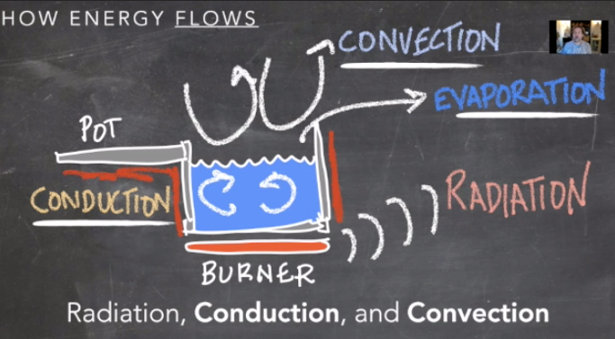
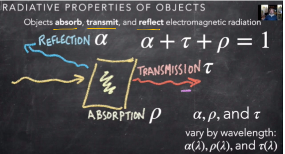
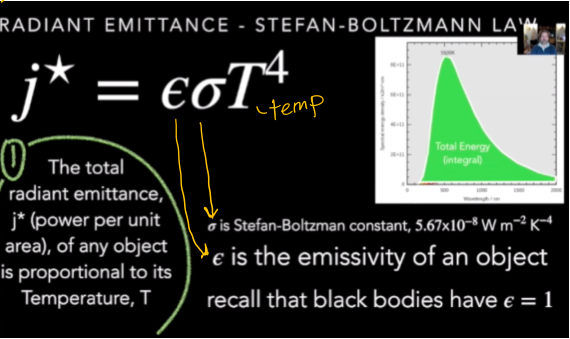
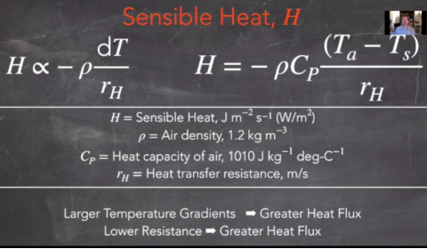
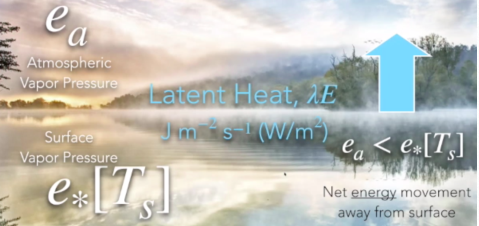
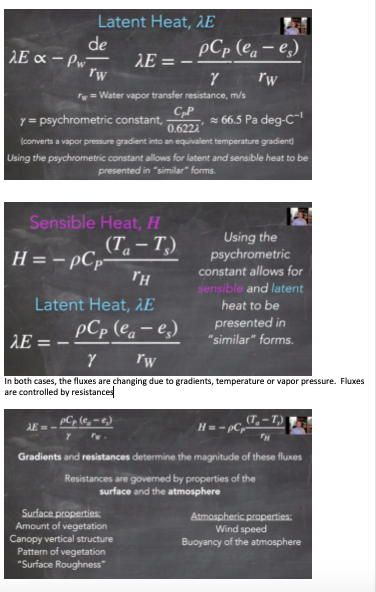
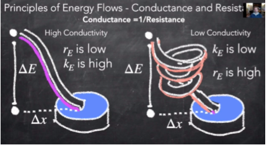

# Energy Balance {#energy}

## Overview

Many variables contribute to the **energy balance** of the Earth System.

This section reviews the properties of energy, as well as the relationship of different properties and their effects on Earth's energy balance.

Here is quick reference to the various factors of the energy balance equation:

## Forms of Energy Transfer

**Radiation:** energy that travels in the form of waves or particles and is part of our everyday environment. People are exposed to radiation from cosmic rays, as well as to radioactive materials found in the soil, water, food, air and also inside the body.

**Conduction:** the process by which heat or electricity is directly transmitted through a substance when there is a difference of temperature or of electrical potential between adjoining regions, without movement of the material.

**Convection:** the movement caused within a fluid by the tendency of hotter and therefore less dense material to rise, and colder, denser material to sink under the influence of gravity, which consequently results in transfer of heat.

**Evaporation:** the process of turning from liquid into vapor.

## Shortwave and Longwave Radiation

**Short wave** = high energy radiation

**Long wave** = low energy radiation

Higher the temperature, the higher the emittance

Sun - emits shortwave

Earth - emits longwave

Space - none really

## Radiative Absorption, Reflection, and Transmission

**Absorption:** taking in radiation

**Reflection:** sending back radiation

**Transmission:** exchanging radiation

## Albedo

Albedo (meaning “whiteness”) is a measure of reflectivity of visible light.  It is measured on a scale from 0 (corresponding to a blackbody) to 1 (completely white/reflective).White objects reflect all wavelengths of light, therefore they have a high albedo.

## Emissivity

**Emissivity** is the efficiency at which electromagnetic energy is emitted.  Or the measure of an object's ability to emit infrared energy. Emitted energy indicates the temperature of the object. Emissivity can have a value from 0 (shiny mirror) to 1.0 (blackbody). Most organic, painted, or oxidized surfaces have emissivity values close to 0.95.

## Relationship of Radiative Energy and Temperature

All objects emit radiation if their temperature is greater than absolute zero (zero degrees Kelvin).

There is an inverse relationship between wave length and frequency (small wavelength, high frequency).

There is a direct relationship between radiative energy and temperature. Radiation is proportional to temperature. The sun emits energy that is within the light spectrum that we can see with human eyes. 

**Black Body** - an idealized opaque, non-reflective body.  Perfect emitter, emissivity = 1. It emits ALL possible energy given its temperature.

### Stefan-Boltzmann Law

the total energy radiated per unit surface area of a black body across all wavelengths per unit time j⋆ (also known as the black-body radiant emittance) is directly proportional to the fourth power of the black body's thermodynamic temperature T:

### Wein’s Displacement Law

The black-body radiation curve for different temperatures will peak at different wavelengths that are inversely proportional to the temperature. As the temperature increases, the overall radiated energy increases, we see shorter wavelengths

## Sensible Heat

The energy you can feel.  The energy required to change the temperature of a substance with no phase change. The temperature change can come from the absorption of sunlight by the soil or the air itself. Or it can come from contact with the warmer air caused by release of latent heat (by direct conduction).

If the surface temperature is greater than the air temperature, sensible heat will flow from the ground to the atmosphere.  The inverse also happens.  

## Latent Heat

The heat required to convert a solid into a liquid or vapor, or a liquid into a vapor, without change of temperature.

Both latent heat flux and sinsible heat flux are dependent on gradients and resistances:

## Ground Heat Flux

The heat transferred along the temperature gradient through materials directly in contact with each other (in this case the ground). It is the loss of energy by heat conduction through the lower boundary. It is a positive number when it is directed away from the surface into the ground

## Conductance vs Resistance

For any convective flux, the gradients and the resistances determine the magnitude of these fluxes.

