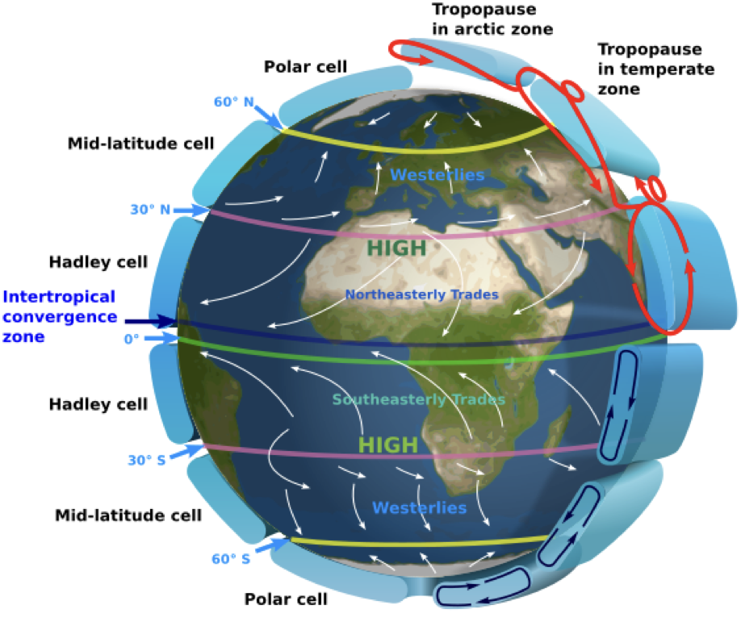
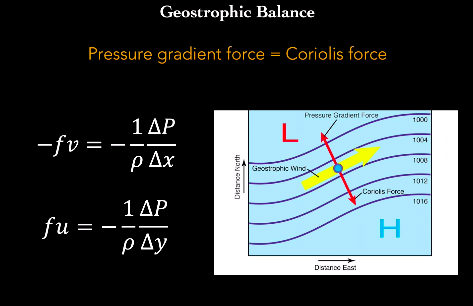
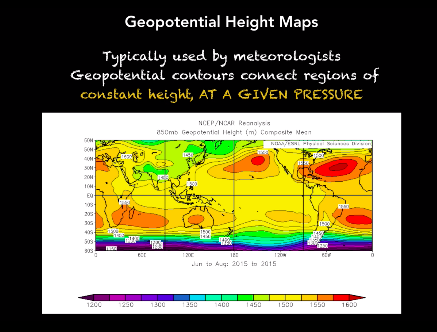
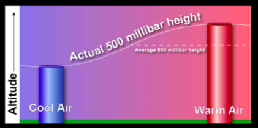
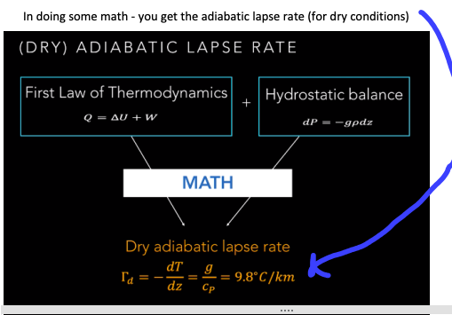
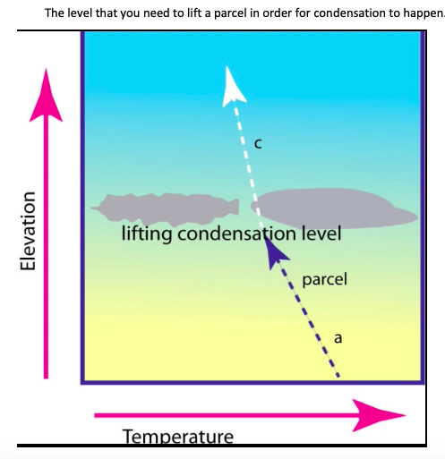
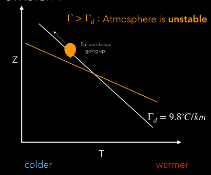
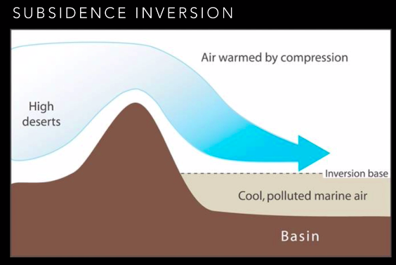

# Atmospheric Science {#atmosphere}

## Overview

This section examines the major forces driving motion of the atmosphere: gravity, friction, the pressure gradient force, the Coriolis force, and vertical motions in the atmosphere and the incredibly important role water vapor plays in atmospheric circulation.

## Movement of Air Parcels

An **air parcel** is like an imaginary balloon of air to demonstrate what is happening in this system.

RISE when heated, expands and becomes less dense than the air around it 

LOWERs when it cools, becomes more dense than the air around it 

Ideal gas law: pressure inversely proportional to volume

Temperature and volume are proportional

## Coriolis Effect

The **Coriolis Effect** is an effect whereby a mass moving in a rotating system experiences a force (the Coriolis force) acting perpendicular to the direction of motion and to the axis of rotation. On the earth, the effect tends to deflect moving objects to the right in the northern hemisphere and to the left in the southern and is important in the formation of cyclonic weather systems.

It is a force that arises from the Earth's curvature and rotation.

RULE OF THUMB:
Coriolis force acts to the RIGHT of motion in the Northern Hemisphere, to the LEFT if in the Southern Hemisphere.  Vanishes at the equator.

Two mechanisms drive the Coriolis effect:
* Conservation of angular momentum
* Centripetal acceleration

Explanation - the earth is rotating.  Every spot on the earth travels 360 degrees over the course of the day.  However, depending on where you are in latitudes, you would travel a longer distance if you are at the equator vs the axis of rotation.  Regardless you have the same "angular momentum"  - if you move south, then the earth underneath you moves faster, so you are defected to the west.  Even if you are moving directly along a line of latitude (i.e. moving directly east or west) you are still deflected by the Coriolis effect.  The only way to avoid Coriolis effect is if you are traveling directly along the equator, or are firmly attached to the surface.

## Hadley Circulation

The **Hadley cell**, named after George Hadley, is a global scale tropical atmospheric circulation that features air rising near the Equator, flowing poleward at a height of 10 to 15 kilometers above the earth's surface, descending in the subtropics, and then returning equatorward near the surface.

It occurs because Warm air rises at the equator and cools and then diverges north and south. As air cools, it sinks again and converges back at the equator.

## Geostrophic Balance & Geostriphic Wind

Geostrophic Wind/Flow: The theoretical wind that would result from an exact balance between the **Coriolis force** and the **pressure gradient force** (PGF). This condition is called geostrophic balance.  The geostrophic wind is directed parallel to contour lines (lines of constant pressure at a given height). This balance seldom holds exactly in nature. The true wind almost always differs from the geostrophic wind due to other forces such as friction from the ground. Despite this, much of the atmosphere outside the tropics is close to geostrophic flow much of the time and it is a valuable first approximation.

Pressure gradients are perpendicular to local pressure contour lines. Like all gradients, the direction fo the gradient goes from high to low.

This effect results in different wind patterns around high and low pressure zones.

## Hydrostatic Balance

In fluid mechanics, **hydrostatic equilibrium** or **hydrostatic balance** is the condition of a fluid (fluid can be air or water) at rest. This occurs when external forces such as gravity are balanced by a pressure-gradient force.

## Geopotential Height

**Geopotential height** is the work that must be done against Earth’ gravitational field to raise a 1kg mass from sea level to a height of z.

Geopotential height maps (usually in meters) are always associated with pressure, and is closely related to temperature; cooler air parcels are smaller/denser and easier to reach the top; warmer parcels are “taller” because they’re less dense and there is further to reach the top to reach a certain pressure 

Depending on the temperature of the air, will require you to go to a higher "height / geopotential height" to get to a certain pressure.  I.e. if you want to get to a pressure of 500 millibars, then as you go up in the atmosphere, you have to go to different heights to get to that pressure for cold air vs warm air.

## Adiabatic Lapse Rates

**Adiabatic lapse rates** look at the change in temperature through the change in height (z).

An **Adiabatic process** is one where no energy exchange is happening between the environment and an isolated air parcel. When air moves this way you can change the volume, temperature and pressure

The amount of energy/heat coming into an air parcel results in the air parcel to either do work (to get rid of the heat) or internalize the heat (change the amount of internal energy in the air parcel).

Adiabatic Lapse Rates differ depending on atmospheric conditions – if the air is undersaturated then you follow the dry adiabatic lapse rate.  But when you reach the lifting condensation level, the moisture condenses and you follow the moist adiabatic lapse rate.  The moist adiabatic lapse rate will always be lower than the dry adiabatic lapse rate.

### Dry Adiabatic Lapse Rate

When an air parcel does not contain any moisture, we use **Dry Adiabatic Lapse Rate** - If you raise the air parcel adiabatically, then using the gas law, your volume is going to be larger and temperature is going to be smaller. This explains why when you go to the top of a mountain, it is colder and there is less air.   However, air doesn’t follow the dry conditions perfectly because there is always moisture in the air.

### Moist Adiabatic Lapse Rate

A parcel of air containing water vapor rises, expands, cools and eventually the water condenses.  Then latent heat is released into the air parcel and it warms up slightly.  So all of the same processes of the adiabatic process are happening but energy is released into the air parcel, so atmospheric moisture makes temperature decrease more slowly with height.

Moist adiabatic lapse rate depends on amount of water present. This makes the lapse rate less negative / temperature decreases more slowly with height than it would with no moisture there, because some of heat you lose is added back through the release of latent energy when moisture condenses.

Values can vary typically between 4 and 8 C/km, but generally we will use the following formula:

## Vapor Pressure & Saturation Vapor Pressure

**Vapor Pressure** is the pressure of vapor above a liquid surface.

**Saturation Vapor Pressure** is the pressure of vapor above a liquid surface (usually water – but true for any liquid) when it is at equilibrium with its surroundings.

It varies strongly with pressure, as seen in the saturation vapor pressure curve. The higher temperatures mean higher saturation vapor pressure – this helps us determine where clouds will form.

## Lifting Condensation Level

**Lifting condensation level** is the level, or height, that you need to lift a parcel to in order for condensation to happen.

## Static Stability

Defined as the stability of the atmosphere in hydrostatic equilibrium with respect to vertical displacements. ... The stability of the parcel is dependent upon the parcel's motion after a forced displacement from an original location.

If your lapse rate is lower than the dry adiabatic lapse rate then your atmosphere is stable; if you change height on blue line, you don’t change temperature as quickly.

Stable:

Unstable:

Rules of Thumb for Static Stability
* Local lapse rate exceeds the adiabatic lapse rate, the atmosphere is unstable.
* Inversions happen in stable atmospheres.
* The type of clouds you’re likely to see depend on the local atmospheric stability.

## Inversions

Sometimes air doesn’t cool as you get higher in the atmosphere.  And this is what happens with an inversion.  Important implications for air quality. Causes a layer of smog to sit above a city. 

### Subsidence Inversion

Subsidence Inversion: air warmed by compression, from high deserts, flows to lower elevations gaining in pressure and temperature (adiabatic) and sits on top of the inversion base (cooler air). Ex: LA smog is often caused by this and the marine inversion 

### Marine Inversion

Marine: in coastal areas; cool marine air is brought to land by prevailing winds. It is cool and dense so sinks low, and warmer air from land flows above it. Examples: marine layer in the morning, “June gloom”

### High Pressure Inversion

High Pressure: caused by a high pressure system aloft, air diverges and spreads at inversion base

## Fronts

A **front** is a time when there is a strong gradient of temperatures and masses of air coming together.  Cold front is the denser mass of air goes underneath the less dense warmer air.  Oppositely, there can be a warm front where the warm front that goes up above the cold air.  The difference in fronts is just what way the air is moving.

Cold: mass of cold air hitting a mass of warmer air ; cold air is denser, advances and replaces warm air 
Warm: Warm air replaces cool air 

